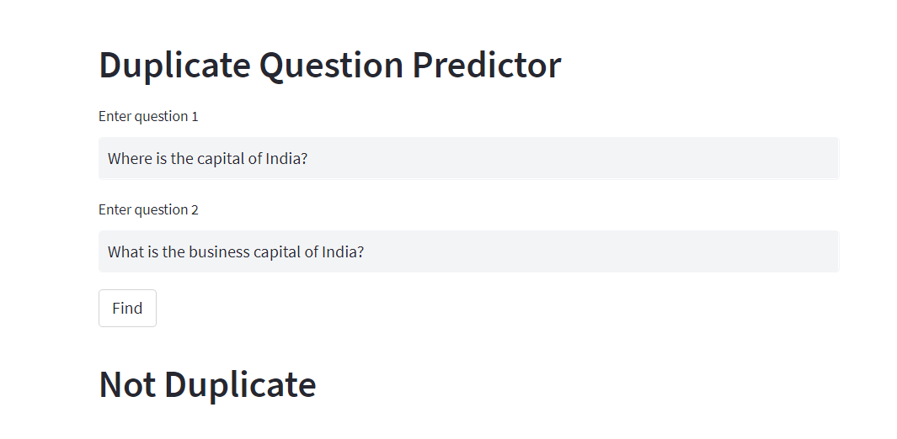
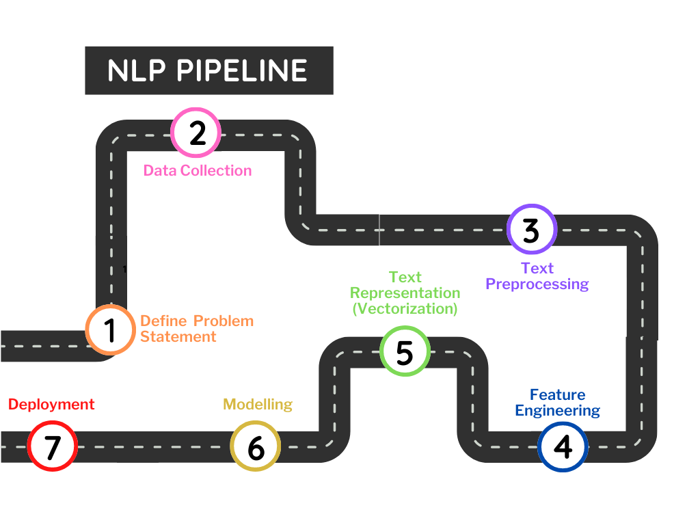

# Duplicate Question Detector:
The ipython notebook is working to build a model which will detect duplicate questions if two questions pair are given.  
The dataset used has been taken from: <a href="https://www.kaggle.com/competitions/quora-question-pairs">Kaggle: Quora Question Pairs</a>  
You can follow the analysis on <a href="https://www.kaggle.com/code/shrikrishnaparab/find-duplicate-questions-pair">kaggle</a>  

## Deployment:
Streamlit is used to build a front-end of the web application for Duplicate Question Detector and is deployed on huggingface.co.

### Check the app:

## Packeges Used:
 ![Python][python] ![scikit-learn][sklearn-image] ![Pandas][Pandas-image]  ![Jupyter Notebook][ipython-image] 
 
[python]: https://img.shields.io/badge/python-3670A0?style=for-the-badge&logo=python&logoColor=ffdd54
[sklearn-image]:https://img.shields.io/badge/scikit--learn-%23F7931E.svg?style=for-the-badge&logo=scikit-learn&logoColor=white
[Pandas-image]: https://img.shields.io/badge/pandas-%23150458.svg?style=for-the-badge&logo=pandas&logoColor=white
[ipython-image]: https://img.shields.io/badge/jupyter-%23FA0F00.svg?style=for-the-badge&logo=jupyter&logoColor=white

## Process:

  
## Process flow is as follows:  
### Problem Statement
Over 100 million people visit Quora every month, so it's no surprise that many people ask similarly worded questions. Multiple questions with the same intent can cause seekers to spend more time finding the best answer to their question, and make writers feel they need to answer multiple versions of the same question. Quora values canonical questions because they provide a better experience to active seekers and writers, and offer more value to both of these groups in the long term. The aim of this project is to classify whether question pairs are duplicates or not. 

### Data Collection:
In this project we have use the labeled dataset given by Quora to solve this problem statement.
### Data Preprocessing:  
      1. Drop the null values.
      2. Lowercase: convert the name to lowercase
      3. Replace certain special characters with their string equivalents for e.g. $ to dollar, % to percent and so on.
      4. Decontracting words 
      5. Removing HTML tags
      6. Remove punctuations
### Feature Engineering:  
Creating new features, in this project we have ceated new features which can be classified as basic features and advance features. you can check the list in the notebook.
### Text Representation:
Test is represented in the vector form using Bag of words technique. 
### Modelling:
Train a Model using RadomForest.
### Deployment
Deploy the model and use it in a Webapplication. We have used HuggingFace to Deploy.
